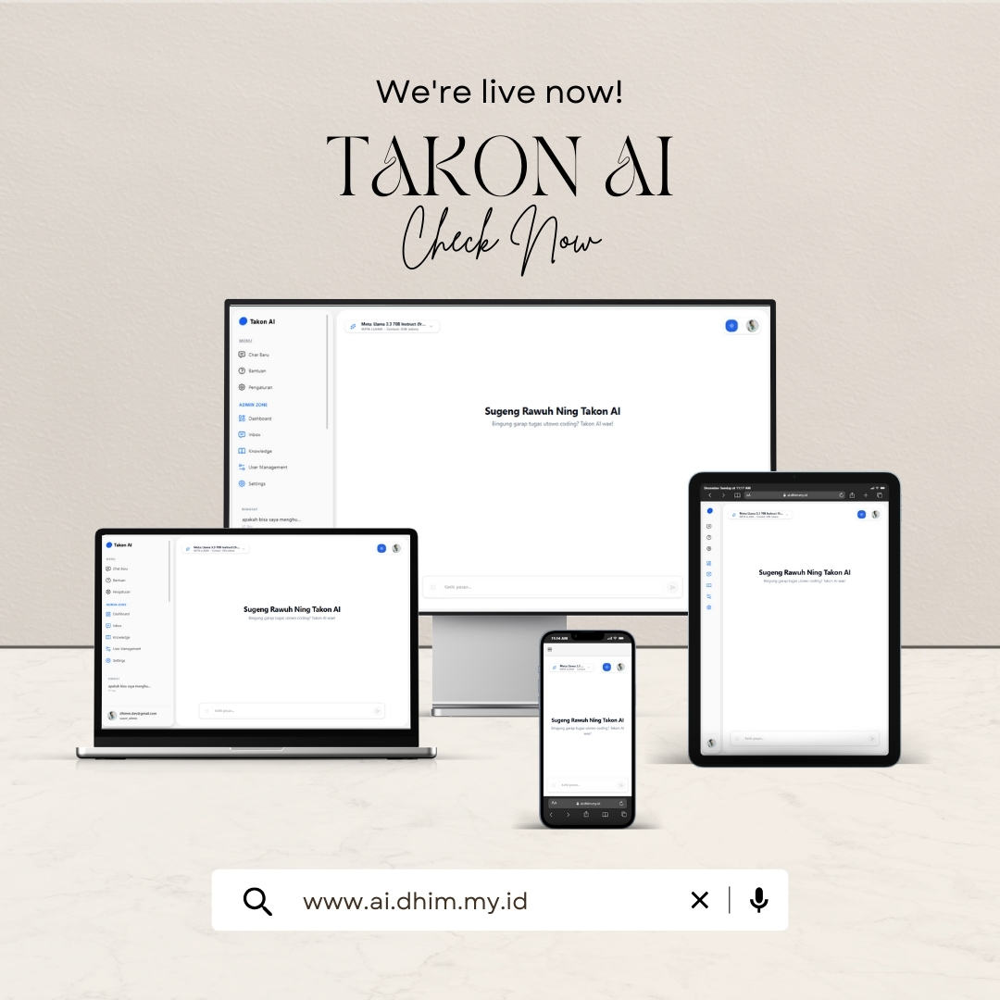

# Takon AI - Intelligent Chatbot Platform 🤖



**Takon AI** adalah platform asisten virtual cerdas berbasis web yang dibangun dengan teknologi terbaru tahun 2024/2025. Proyek ini mengintegrasikan kecerdasan buatan (_Artificial Intelligence_) dari berbagai model terkemuka (Qwen, Gemini, Llama) ke dalam antarmuka yang modern, responsif, dan aman.

> **Status Proyek:** Active Development 🚀
> **Versi:** 1.0.0

---

## ✨ Fitur Unggulan (Key Features)

### 🧠 AI Core

- **Multi-Model Intelligence:** Switcher model instan antara Qwen, Gemini, dan Llama (via OpenRouter).
- **Vision Capabilities:** Analisis gambar _drag-and-drop_ (khusus model Gemini).
- **Thinking Process UI:** Visualisasi proses berpikir AI (_Chain of Thought_) dengan gaya "Blue Tone" yang transparan.
- **Markdown Support:** Chatbot mampu merender kode, tabel, list, dan notasi matematika dengan rapi.

### 🛡️ Enterprise-Grade Security

- **Next-Gen Auth:** Integrasi Supabase SSR & Google OAuth 2.0.
- **Bot Protection:** Menggunakan **Cloudflare Turnstile** untuk menangkal spammer di halaman login.
- **Middleware Protection:** Validasi sesi server-side (Edge Runtime) untuk memproteksi rute sensitif.
- **RBAC (Role-Based Access Control):** Sistem permission ketat (Admin vs User).

### ⚡ Real-time Experience

- **Live Support System:** Tiket bantuan dengan update status otomatis tanpa refresh (WebSockets).
- **Broadcast Widget:** Pengumuman admin yang muncul secara animasi _real-time_ kepada user online.
- **Instant Feedback:** Modal rating otomatis muncul setelah tiket diselesaikan.

---

## 🛠️ Tech Stack (Latest Versions)

Aplikasi ini dibangun menggunakan pustaka versi terbaru untuk performa maksimal:

- **Framework:** [Next.js 16 (App Router)](https://nextjs.org/) - React 19 Support
- **Language:** TypeScript 5
- **Styling:** [Tailwind CSS 4](https://tailwindcss.com/) - Engine baru yang lebih cepat
- **Database & Auth:** [Supabase](https://supabase.com/)
- **ORM:** [Prisma 7](https://www.prisma.io/) - Type-safe database client
- **Animation:** Motion (Framer Motion baru)
- **Icons:** Lucide React & Tabler Icons

---

## � Struktur Folder Lengkap

Berikut adalah struktur direktori lengkap dari _source code_ proyek ini:

```bash
📦 chatbot
 ┣ 📂 .next                 # Hasil build Next.js (Generated)
 ┣ 📂 prisma                # Konfigurasi Database
 ┃ ┗ 📜 schema.prisma       # Skema tabel (User, Chat, Ticket)
 ┣ 📂 public                # Aset statis (Gambar, Icon)
 ┣ 📂 src
 ┃ ┣ 📂 app
 ┃ ┃ ┣ 📂 (auth)            # Halaman Autentikasi (Route Group)
 ┃ ┃ ┃ ┣ 📂 login
 ┃ ┃ ┃ ┃ ┗ 📜 page.tsx      # Halaman Login
 ┃ ┃ ┃ ┗ 📂 signup
 ┃ ┃ ┃ ┃ ┗ 📜 page.tsx      # Halaman Daftar
 ┃ ┃ ┣ 📂 (main)            # Halaman Utama (Protected)
 ┃ ┃ ┃ ┣ 📂 admin           # Area khusus Admin
 ┃ ┃ ┃ ┃ ┣ 📂 dashboard
 ┃ ┃ ┃ ┃ ┣ 📂 inbox
 ┃ ┃ ┃ ┃ ┗ � settings
 ┃ ┃ ┃ ┣ 📂 chat
 ┃ ┃ ┃ ┃ ┗ 📂 [id]          # Dynamic Route untuk Chat spesifik
 ┃ ┃ ┃ ┣ 📂 settings        # Halaman Pengaturan User
 ┃ ┃ ┃ ┗ 📂 support         # Halaman Bantuan
 ┃ ┃ ┣ 📂 api               # Backend API Endpoints
 ┃ ┃ ┃ ┣ 📂 auth
 ┃ ┃ ┃ ┣ 📂 chat
 ┃ ┃ ┃ ┣ 📂 models
 ┃ ┃ ┃ ┗ 📂 support
 ┃ ┃ ┣ � globals.css       # Global Styles (Tailwind 4 config)
 ┃ ┃ ┗ 📜 layout.tsx        # Root Layout
 ┃ ┣ 📂 components
 ┃ ┃ ┣ 📂 admin             # Widget Admin (Stats, Inbox)
 ┃ ┃ ┣ 📂 chat              # Komponen Chat (Bubble, Input)
 ┃ ┃ ┣ 📂 ui                # Reusable UI (Button, Input, Modal)
 ┃ ┃ ┣ � app-sidebar.tsx   # Sidebar Navigasi Utama
 ┃ ┃ ┣ 📜 broadcast-widget.tsx # Widget Pengumuman
 ┃ ┃ ┣ 📜 login-form.tsx    # Form Login + Turnstile
 ┃ ┃ ┗ � theme-provider.tsx # Dark Mode Context
 ┃ ┣ 📂 hooks               # Custom React Hooks
 ┃ ┣ 📂 lib                 # Pustaka & Utils
 ┃ ┗ 📂 utils               # Helper Functions
 ┃ ┃ ┣ 📂 supabase
 ┃ ┃ ┣ 📜 check-role.ts     # Cek Role Admin
 ┃ ┃ ┗ 📜 events.ts         # Event Bus System
 ┣ 📜 .env                  # Environment Variables
 ┣ 📜 middleware.ts         # Edge Middleware (Auth Guard)
 ┣ 📜 next.config.ts        # Next.js Configuration
 ┣ 📜 package.json          # Manifest Dependencies
 ┣ 📜 postcss.config.mjs    # PostCSS Config
 ┗ 📜 tsconfig.json         # TypeScript Config
```

---

## 🚀 Panduan Instalasi (Getting Started)

### Prasyarat

- Node.js v20 (Rekomendasi)
- npm / pnpm / yarn

### 1. Clone Repository & Install

```bash
git clone https://github.com/f4kesmile/chatbot.git
cd takon-ai
npm install
```

### 2. Konfigurasi Environment Variables (`.env`)

Buat file `.env` di root folder proyek. Berikut adalah **template lengkap** yang harus diisi agar semua fitur (AI, Auth, Security) berjalan 100%:

```env
# ------------------------------------------------------------------
# 1. DATABASE CONFIGURATION (Supabase / PostgreSQL)
# ------------------------------------------------------------------
# URL koneksi database utama (mendukung PGBouncer/Transaction mode)
DATABASE_URL="postgresql://postgres:[PASSWORD]@[HOST]:5432/postgres?pgbouncer=true"

# URL koneksi langsung untuk migrasi data (Session mode)
DIRECT_URL="postgresql://postgres:[PASSWORD]@[HOST]:5432/postgres"

# ------------------------------------------------------------------
# 2. SUPABASE AUTHENTICATION
# ------------------------------------------------------------------
# URL Project Supabase Anda
NEXT_PUBLIC_SUPABASE_URL="https://[PROJECT-ID].supabase.co"

# Key Paling Penting: Anon Key (Client-side safe)
NEXT_PUBLIC_SUPABASE_ANON_KEY="eyJhbGciOiJIUzI1NiIsInR5..."

# ------------------------------------------------------------------
# 3. AI PROVIDER (OPENROUTER)
# ------------------------------------------------------------------
# API Key untuk mengakses model Qwen, Gemini, dan Llama
# Dapatkan di: https://openrouter.ai/keys
OPENROUTER_API_KEY="sk-or-v1-..."

# ------------------------------------------------------------------
# 4. SECURITY & ANTIBOT (CLOUDFLARE TURNSTILE)
# ------------------------------------------------------------------
# Site Key untuk Widget Frontend
NEXT_PUBLIC_CLOUDFLARE_SITE_KEY="0x4AAAA..."

# Secret Key untuk Validasi Backend (Opsional tapi Recommended)
CLOUDFLARE_SECRET_KEY="0x4AAAA..."

# ------------------------------------------------------------------
# 5. APPLICATION CONFIG
# ------------------------------------------------------------------
# URL Aplikasi saat berjalan (Local vs Production)
NEXT_PUBLIC_APP_URL="http://localhost:3000"

# Mode Aplikasi (development / production)
NODE_ENV="development"
```

### 3. Setup Database (Prisma 7)

```bash
# Push skema ke database Supabase
npx prisma db push

# Generate prisma
npx prisma generate

# (Opsional) Buka Prisma Studio untuk melihat data
npx prisma studio
```

### 4. Jalankan Server Dev (Next.js 16)

```bash
npm run dev
```

Akses di browser: `http://localhost:3000`

---

## 🤝 Kontribusi

Pull Request sangat diterima! Pastikan Anda menggunakan **Next.js 16** dan **Tailwind 4** saat mengembangkan fitur baru.

---

<p align="center">
  Built with ❤️ by Dhimm
</p>
